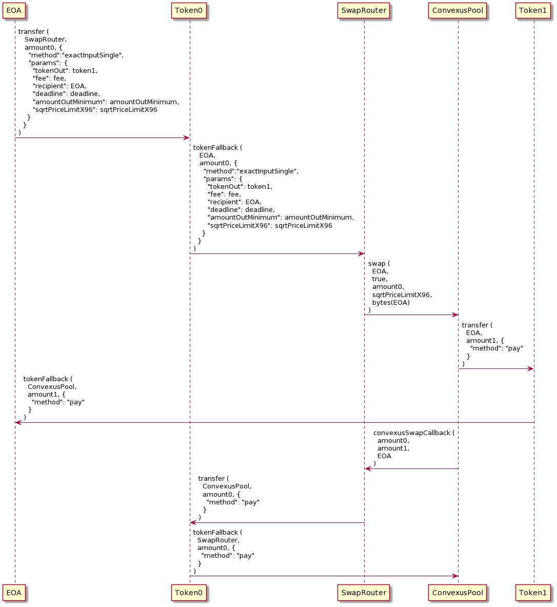

# Convexus Pool Contract Documentation

# **Pool initialization**


## 📜 `ConvexusPool::initialize`


## Method Call

- Sets the initial price for the pool
- Access: Everyone
- Price is represented as a sqrt(amountToken1/amountToken0) [Q64.96 value](/Convexus-Commons/Librairies/docs/README.md#how-to-encode-a-q6496-price)

```java
@External
public void initialize (BigInteger sqrtPriceX96)
```

- `sqrtPriceX96`: the initial sqrt price of the pool as a Q64.96

### Example call:

```java
{
  "to": ConvexusPool,
  "method": "initialize",
  "params": {
    "sqrtPriceX96": "0x50f44d8921243b6cdba25b3c" // encodePriceSqrt(1, 10)
  },
}
```

# **Tokens Swap**

A Convexus Pool is able to swap two tokens by calling its `swap` method given an amount of token to be swapped and a minimum price for doing so, so the user doesn't end with less tokens than expected.

The `swap` method must **not** be called directly from a EOA address. Another contract should handle the user tokens during the swap. Only another SCORE contract can deposit some tokens to a Convexus Pool contract, otherwise the transaction will be reverted.

Below is the entire process flow for swapping a fixed amount of `token0` to a Convexus Pool, using a Convexus Swap Router.

> ⚠️ Please note that the methods implemented in the `SwapRouter` contract isn't part of the Core layer, so it isn't mandatory for calling the `swap` method. In the example below, the `SwapRouter` contract implements a `exactInputSingle` method that swaps a given `amount0` of `token0` for a minimum amount of `amountOutMinimum` for `token1`.



## **Step 1: Handle deposits from EOA to the `SwapRouter` contract**

The `SwapRouter` contract should handle the tokens deposits and withdrawals from all EOA addresses. 

For a simple token swap, we recommand using the `exactInputSingle` method from the `SwapRouter` contract.  See [SwapRouter::exactInputSingle](/Convexus-Periphery/Contracts/SwapRouter/docs/README.md#-swaprouterexactinputsingle) for more information.

## **Step 2: Request a swap**

Once the users deposited all necessary tokens, the `SwapRouter` contract should call the Pool `swap` method.

## 📜 `ConvexusPool::swap`

## Method Call

- Swap token0 for token1, or token1 for token0
- Access: Everyone
- The caller of this method receives a callback in the form of `convexusSwapCallback`. If the caller doesn't implement this method, the call will fail.

```java
@External
public PairAmounts swap (
    Address recipient,
    boolean zeroForOne,
    BigInteger amountSpecified,
    BigInteger sqrtPriceLimitX96,
    byte[] data
)
```

- `recipient`: The address to receive the output of the swap
- `zeroForOne`: The direction of the swap, true for token0 to token1, false for token1 to token0
- `amountSpecified`: The amount of the swap, which implicitly configures the swap as exact input (positive), or exact output (negative)
- `sqrtPriceLimitX96`: The Q64.96 sqrt price limit. If zero for one, the price cannot be less than this
- `data`: Any data to be passed through to the callback

### Example call:

```java
{
  "to": ConvexusPool,
  "method": "swap",
  "params": {
    "recipient": EOA,
    "zeroForOne": "0x1", // token0 -> token1
    "amountSpecified": "0xde0b6b3a7640000", // 10**18
    "sqrtPriceLimitX96": "0xb504f333f9de6484597d89b3", // encodePriceSqrt(1, 2)
    "data": bytes(EOA) // may be anything useful in convexusSwapCallback
  },
}
```

## **Step 3: The `convexusSwapCallback` callback**

Once the swap has been performed, the `convexusSwapCallback` must fulfill all requirements from the ConvexusPool. See [SwapRouter::convexusSwapCallback](/Convexus-Periphery/Contracts/SwapRouter/docs/README.md#-swaprouterconvexusswapcallback) for more information.