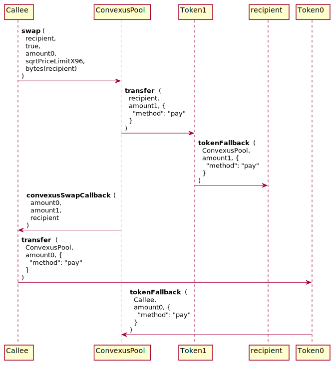

# Convexus Pool Contract Documentation

Convexus Pool is the most important part of the Core Layer. It performs all low levels operations such as swaps, flash loans, liquidity management or rewards management.

# **Pool initialization**


## `ConvexusPool::initialize`


### 📜 Method Call

- Sets the initial price for the pool. May only be called once.
- Access: Everyone
- Price is represented as a sqrt(amountToken1/amountToken0) [Q64.96 value](/Convexus-Commons/Librairies/docs/README.md#how-to-encode-a-q6496-price)

```java
@External
public void initialize (BigInteger sqrtPriceX96)
```

- `sqrtPriceX96`: the initial sqrt price of the pool as a Q64.96

### 🧪 Example call

```java
{
  "to": ConvexusPool,
  "method": "initialize",
  "params": {
    "sqrtPriceX96": "0x50f44d8921243b6cdba25b3c" // encodePriceSqrt(1, 10)
  },
}
```

# **Tokens Swap**

A Convexus Pool is able to swap two tokens by calling its `swap` method. For doing so, it needs an amount of token to be swapped and a minimum price, so the user doesn't end with less tokens than expected.

The `swap` method must **not** be called directly from a EOA address. Another contract outside of the Core Layer should handle the user tokens during the swap. Consequently, only another SCORE contract can deposit tokens to a Convexus Pool contract, otherwise the transaction will be reverted.

Below is the entire process flow for swapping a fixed amount of `token0` to a Convexus Pool from a generic `Callee` contract.

> ⚠️ Please note that the methods implemented in the generic `Callee` contract isn't part of the Core layer, so its implementation may be anything. In most cases, a `SwapRouter` is used for performing the swaps. See [SwapRouter documentation](/Convexus-Periphery/Contracts/SwapRouter/docs/README.md#tokens-swap) for more information.



## `ConvexusPool::swap`

### 📜 Method Call

- Swap token0 for token1, or token1 for token0
- Access: Everyone
- The caller of this method receives a callback in the form of `convexusSwapCallback`. If the caller doesn't implement this method, the call will fail.

```java
@External
public PairAmounts swap (
    Address recipient,
    boolean zeroForOne,
    BigInteger amountSpecified,
    BigInteger sqrtPriceLimitX96,
    byte[] data
)
```

- `recipient`: The address to receive the output of the swap
- `zeroForOne`: The direction of the swap, true for token0 to token1, false for token1 to token0
- `amountSpecified`: The amount of the swap, which implicitly configures the swap as exact input (positive), or exact output (negative)
- `sqrtPriceLimitX96`: The Q64.96 sqrt price limit. If zero for one, the price cannot be less than this
- `data`: Any data to be passed through to the callback

### 🧪 Example call

```java
{
  "to": ConvexusPool,
  "method": "swap",
  "params": {
    "recipient": EOA,
    "zeroForOne": "0x1", // token0 -> token1
    "amountSpecified": "0xde0b6b3a7640000", // 10**18
    "sqrtPriceLimitX96": "0xb504f333f9de6484597d89b3", // encodePriceSqrt(1, 2)
    "data": bytes(EOA) // may be anything useful in convexusSwapCallback
  },
}
```

## `Callee::convexusSwapCallback`

After calling a `ConvexusPool::swap` method, the Pool will send the computed amount of tokens to the recipient address. After doing so, it will be waiting for the correct amount of input tokens owed to the Pool. In the `convexusSwapCallback` implementation, you must pay the pool tokens owed for the swap, or the transaction will revert.

Additionnally, the caller of this method must be checked to be a `ConvexusPool` deployed by the canonical `ConvexusFactory`. `amount0Delta` and `amount1Delta` can both be 0 if no tokens were swapped.

### 📜 Method Call

- Called to `msg.sender` after executing a swap via `ConvexusPool::swap`.
- Access: Everyone
- In the implementation you must pay the pool tokens owed for the swap.
- The caller of this method must be checked to be a ConvexusPool deployed by the canonical ConvexusFactory. 
- `amount0Delta` and `amount1Delta` can both be 0 if no tokens were swapped.


```java
@External
public void convexusSwapCallback (
    BigInteger amount0Delta,
    BigInteger amount1Delta,
    byte[] data
)
```

- `amount0Delta`: The amount of token0 that was sent (negative) or must be received (positive) by the pool by the end of the swap. If positive, the callback must send that amount of token0 to the pool.
- `amount1Delta`: The amount of token1 that was sent (negative) or must be received (positive) by the pool by the end of the swap. If positive, the callback must send that amount of token1 to the pool.
- `data`: Any data passed through by the caller via the swap call

### 🧪 Example call

```java
{
  "to": Callee,
  "method": "convexusSwapCallback",
  "params": {
    "amount0Delta": "0x1000", // needs to be paid to the pool
    "amount1Delta": "0x0",
    "data": [...] // same value than the `swap` data field
  },
}
```
