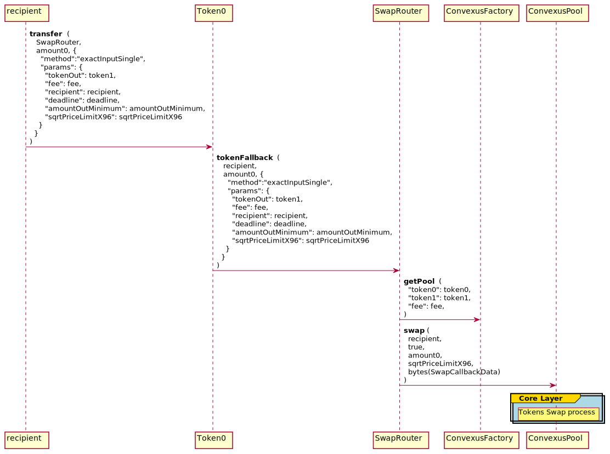

# Convexus SwapRouter Contract Documentation

The `SwapRouter` is the contract doing all verifications in terms of amounts or slippage and handle the swap callback which is responsible to verify the authenticity of the pool. The SwapRouter can manage multiroute swaps.

# **Tokens Swap**

The `SwapRouter` is able to swap two tokens thanks to the [ConvexusPool `swap`](/Convexus-Core/Contracts/Pool/docs/README.md#convexuspoolswap) method. It supports multiple ways of swapping tokens, depending of the user needs:

- `exactInputSingle`: Swaps `amountIn` of one token for as much as possible of another token
- `exactInput`: Swaps `amountIn` of one token for as much as possible of another along the specified path
- `exactOutputSingle`: Swaps as little as possible of one token for `amountOut` of another token
- `exactOutput`: Swaps as little as possible of one token for `amountOut` of another along the specified path (reversed)

Below is the entire process flow for swapping a fixed amount of `token0` to a Convexus Pool, using the `exactInputSingle` method from a Convexus Swap Router. The process flow is the same for `exactInput`, `exactOutputSingle` and `exactOutput`.


> ⚠️ If you need more detailed information about the token swap process in the core layer, see [here](/Convexus-Core/Contracts/Pool/docs/README.md#tokens-swap).




-------------------------------------------------------------------------------------

# **Single Swaps**

## **Exact Input Swaps**

Exact Input swaps a fixed amount of the input token for a minimum amount of the outbound token. This is the most common swap style.

## `SwapRouter::exactInputSingle`

### 📜 Method Call

```java
// @External - this method is external through tokenFallback
private void exactInputSingle (
    Address caller, 
    Address tokenIn, 
    BigInteger amountIn, 
    ExactInputSingleParams params
)
```

- Swaps `amountIn` of one token for as much as possible of another token
- Access: Everyone
- `caller`: The method caller. This field is handled by tokenFallback
- `tokenIn`: The tokenIn address. This field is handled by tokenFallback
- `amountIn`: The token amount sent. This field is handled by tokenFallback
- `params`: The parameters necessary for the swap, encoded as [`ExactInputSingleParams`](#swaprouterexactinputsingleparams)

### 🧪 Example call

```java
{
  "to": token0, // equivalent to tokenIn
  "method": "transfer",
  "params": {
    "_to": SwapRouter,
    "_value": "0xde0b6b3a7640000", // 10**18 - equivalent to amountIn
    "_data": hex({
      "method": "exactInputSingle",
      "params": {
        "tokenOut": token1,
        "fee": "0xbb8", // 3000, 0.3%
        "recipient": recipient,
        "deadline": "0x61e92f6b", // in seconds
        "amountOutMinimum": "0x0", // we are setting to zero, but this is a significant risk in production. For a real deployment, this value should be calculated using our SDK or an onchain price oracle - this helps protect against getting an unusually bad price for a trade due to a front running sandwich or another type of price manipulation
        "sqrtPriceLimitX96": "0x0" // We set this to zero - which makes this parameter inactive. In production, this value can be used to set the limit for the price the swap will push the pool to, which can help protect against price impact or for setting up logic in a variety of price-relevant mechanisms
      }
    })
  },
}
```

## `SwapRouter::ExactInputSingleParams`

### ⚙️ Structure definition

```java
class ExactInputSingleParams {
  Address tokenOut;
  int fee;
  Address recipient;
  BigInteger deadline;
  BigInteger amountOutMinimum;
  BigInteger sqrtPriceLimitX96;
}
```

- `tokenOut`: The contract address of the outbound token
- `fee`: The fee tier of the pool, used to determine the correct pool contract in which to execute the swap
- `recipient`: The destination address of the outbound token
- `deadline`: The unix time after which a swap will fail, to protect against long-pending transactions and wild swings in prices
- `amountOutMinimum`: The minimum amount of token in output
- `sqrtPriceLimitX96`: The [Q64.96](/Convexus-Commons/Librairies/docs/README.md#how-to-encode-a-q6496-price) sqrt price limit

-------------------------------------------------------------------------------------

## **Exact Output Swaps**

Exact Output swaps a minimum possible amount of the input token for a fixed amount of the outbound token. This is the less common swap style - but useful in a variety of circumstances.

Because this example transfers in the inbound asset in anticipation of the swap - its possible that some of the inbound token will be left over after the swap is executed. The Router will send them back automatically using an `excess` method name in the IRC2 `data` field.

## `SwapRouter::exactOutputSingle`

### 📜 Method Call

```java
// @External - this method is external through tokenFallback
private void exactOutputSingle (
    Address caller, 
    Address tokenIn, 
    BigInteger amountInMaximum, 
    ExactOutputSingleParams params
)
```

- Swaps as little as possible of one token for `amountOut` of another token
- Access: Everyone
- `caller`: The method caller. This field is handled by tokenFallback
- `tokenIn`: The tokenIn address. This field is handled by tokenFallback
- `amountInMaximum`: The maximum amount of `token0` willing to be swapped for the specified amountOut of `token1`. This field is handled by tokenFallback.
- `params`: The parameters necessary for the swap, encoded as [`ExactOutputSingleParams`](#swaprouterexactoutputsingleparams)

### 🧪 Example call

```java
{
  "to": token0, // equivalent to tokenIn
  "method": "transfer",
  "params": {
    "_to": SwapRouter,
    "_value": "0xde0b6b3a7640000", // 10**18 - equivalent to amountInMaximum
    "_data": hex({
      "method": "exactOutputSingle",
      "params": {
        "tokenOut": token1,
        "fee": "0xbb8", // 3000, 0.3%
        "recipient": recipient,
        "deadline": "0x61e92f6b", // in seconds
        "amountOut": "0x1bc16d674ec80000", // 2 * 10**18
        "sqrtPriceLimitX96": "0x0" // We set this to zero - which makes this parameter inactive. In production, this value can be used to set the limit for the price the swap will push the pool to, which can help protect against price impact or for setting up logic in a variety of price-relevant mechanisms
      }
    })
  },
}
```

## `SwapRouter::ExactOutputSingleParams`

### ⚙️ Structure definition

```java
class ExactOutputSingleParams {
  Address tokenOut;
  int fee;
  Address recipient;
  BigInteger deadline;
  BigInteger amountOut;
  BigInteger sqrtPriceLimitX96;
}
```

- `tokenOut`: The contract address of the outbound token
- `fee`: The fee tier of the pool, used to determine the correct pool contract in which to execute the swap
- `recipient`: The destination address of the outbound token
- `deadline`: The unix time after which a swap will fail, to protect against long-pending transactions and wild swings in prices
- `amountOut`: The desired amount of `token1` received after the swap
- `sqrtPriceLimitX96`: The [Q64.96](/Convexus-Commons/Librairies/docs/README.md#how-to-encode-a-q6496-price) sqrt price limit

-------------------------------------------------------------------------------------

# **Multihop Swaps**

## **Exact Input Multi Hop Swaps**

Exact input multi hop swaps will swap a fixed amount on a given input token for the maximum amount possible for a given output, and can include an arbitrary number of intermediary swaps.

## `SwapRouter::exactInput`

### 📜 Method Call

```java
// @External - this method is external through tokenFallback
private void exactInput (
    Address caller,
    Address tokenIn,
    BigInteger amountIn,
    ExactInputParams params
)
```

- Swaps `amountIn` of one token for as much as possible of another along the specified path
- Access: Everyone
- `caller`: The method caller. This field is handled by tokenFallback
- `tokenIn`: The tokenIn address. This field is handled by tokenFallback
- `amountIn` The token amount sent. This field is handled by tokenFallback
- `params` The parameters necessary for the multi-hop swap, encoded as [`ExactInputParams`](#swaprouterexactinputparams)

### 🧪 Example call

```java
{
  "to": token0, // equivalent to tokenIn
  "method": "transfer",
  "params": {
    "_to": SwapRouter,
    "_value": "0xde0b6b3a7640000", // 10**18 - equivalent to amountIn
    "_data": hex({
      "method": "exactInput",
      "params": {
        "path": hex([token0, 3000, token2, 3000, token1]) // Multiple pool swaps are encoded through bytes called a `path`. A path is a sequence of token addresses and poolFees that define the pools used in the swaps. The format for pool encoding is (tokenIn, fee, tokenOut/tokenIn, fee, tokenOut) where tokenIn/tokenOut parameter is the shared token across the pools. Since we are swapping token0 to token2 and then token2 to token1 the path encoding is (token0, 0.3%, token2, 0.3%, token1).
        "recipient": recipient,
        "deadline": "0x61e92f6b", // in seconds
        "amountOutMinimum": "0x0", // we are setting to zero, but this is a significant risk in production. For a real deployment, this value should be calculated using our SDK or an onchain price oracle - this helps protect against getting an unusually bad price for a trade due to a front running sandwich or another type of price manipulation
      }
    })
  },
}
```

## `SwapRouter::ExactInputParams`

### ⚙️ Structure definition

```java
class ExactInputParams {
  byte[] path;
  Address recipient;
  BigInteger deadline;
  BigInteger amountOutMinimum;
}
```

- `path`: A sequence of [`tokenIn`, `fee`, `tokenOut`], which are the variables needed to compute each pool contract address in our sequence of swaps. The multihop swap router code will automatically find the correct pool with these variables, and execute the swap needed within each pool in our sequence. Please see ["How to encode a Swap path"](/Convexus-Commons/Librairies/docs/README.md#how-to-encode-a-swap-path) for more information about how to encode a path.
- `recipient`: The destination address of the outbound asset-
- `deadline`: The unix time after which a transaction will be reverted, to protect against long delays and the increased chance of large price swings therein
- `amountOutMinimum`: The maximum amount of token0 willing to be swapped for the specified amountOut of token1